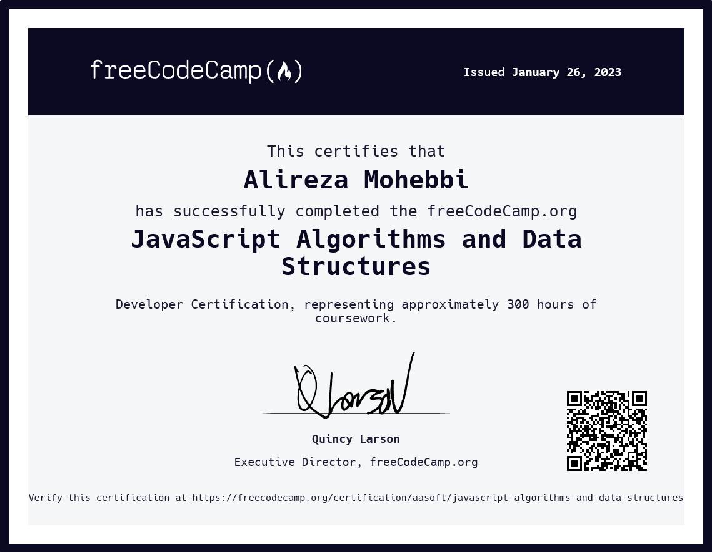
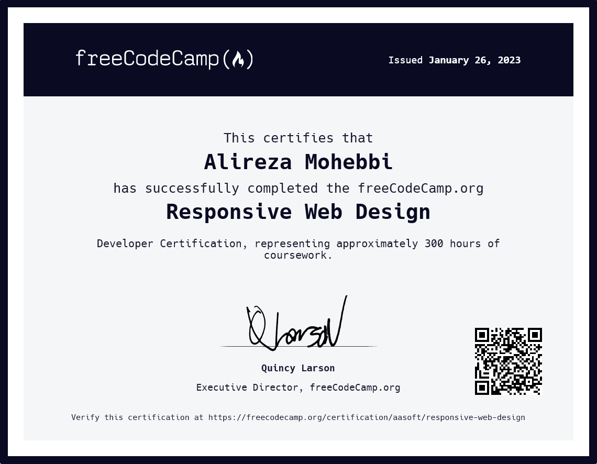
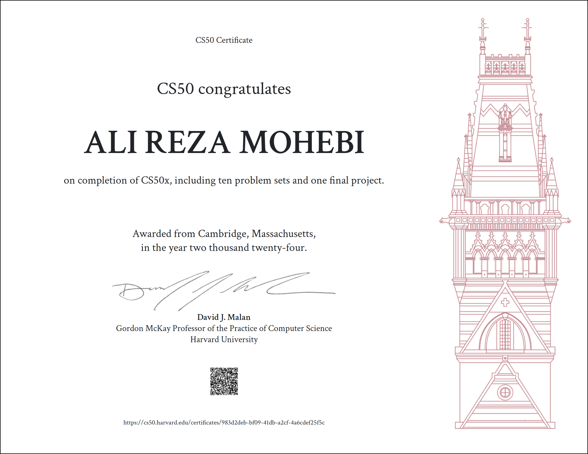
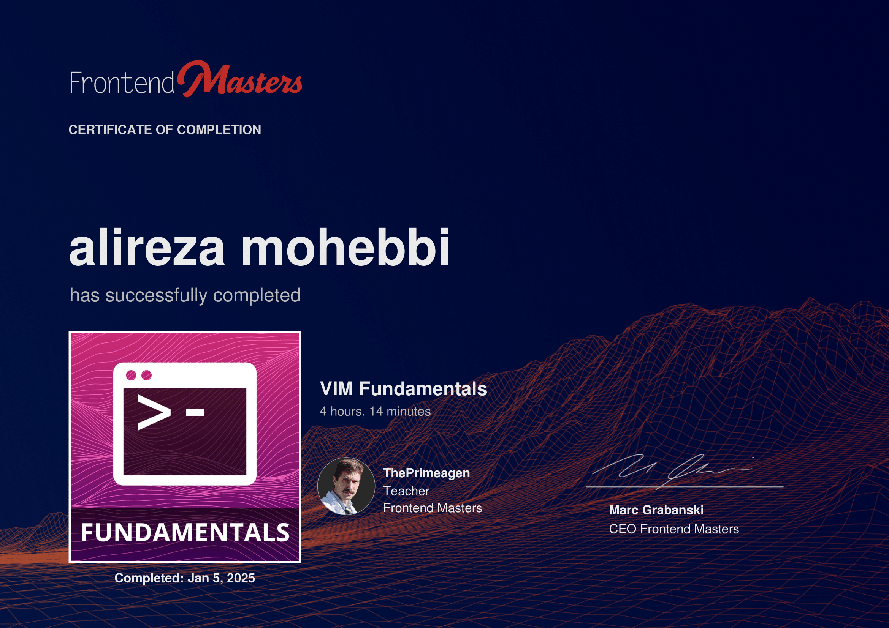
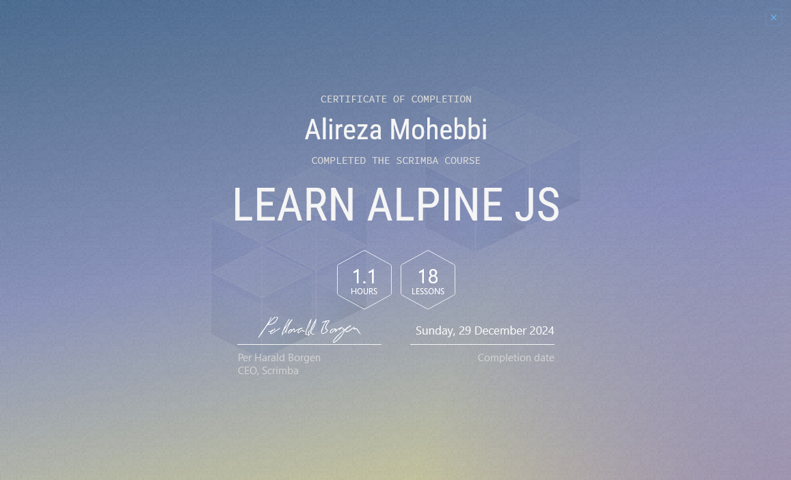
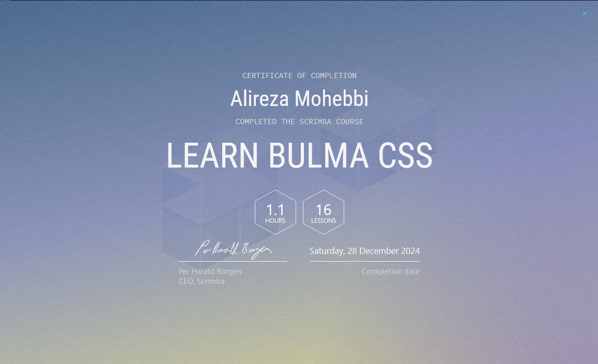
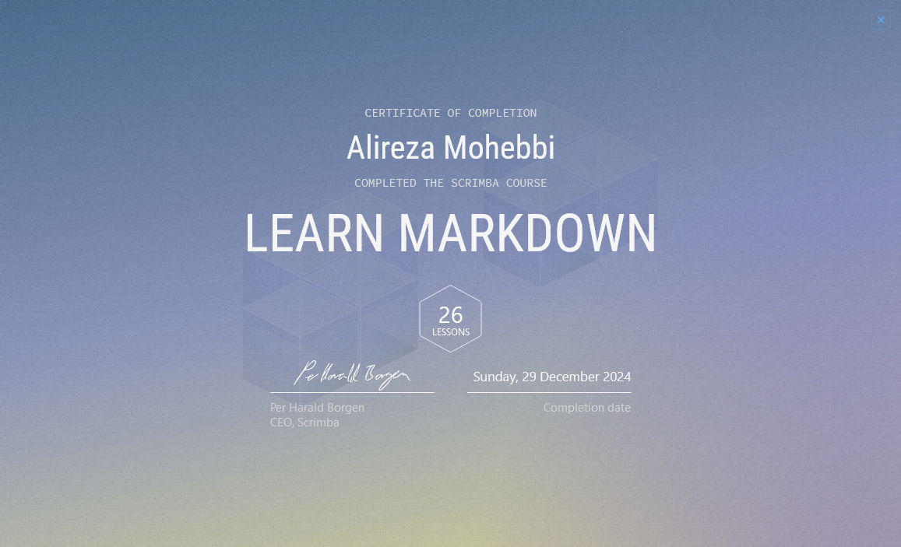
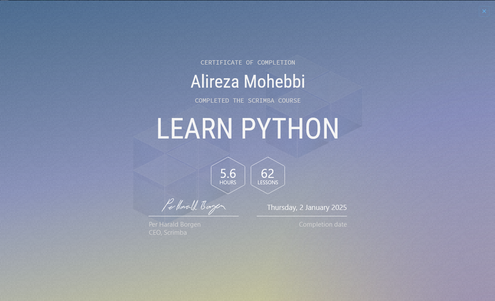

# 🎓 Certificates

Welcome to my portfolio of certificates! Here you'll find a collection of my achievements, each with a brief explanation, an image, and a link to the website where I earned them. Enjoy exploring! 😊

## 📜 Web Components

**Alireza Mohebbi**  

  
**Explanation:**  
This is a Certificate for an Udemy course:Scottjehl - Web Components Demystified 2024.

---

## 📜 ICDL

**Alireza Mohebbi**  
**Note:**  
I need to scan the certificate documents and then upload them here. Please check back later for the updated content.
**Explanation:**  
This is a Certificate for ICDL Skills Exams.

---

## 📜 JavaScript Algorithms and Data Structures

**Alireza Mohebbi**  
  
[View Certificate](https://freecodecamp.org/certification/aasoft/javascript-algorithms-and-data-structures)  
**Explanation:**  
JavaScript Algorithms and Data Structures Certificate from FreeCodeCamp with Developer Certification, representing approximately 300 hours of coursework.

---

## 📜 Responsive Web Design

**Alireza Mohebbi**  
  
[View Certificate](https://freecodecamp.org/certification/aasoft/responsive-web-design)  
**Explanation:**  
Responsive Web Design Certificate from FreeCodeCamp with Developer Certification, representing approximately 300 hours of
coursework.

---

## 📜 CS50

**Alireza Mohebbi**  
  
**Explanation:**  
The CS50 2024 Course and I Finished it!

---

## 📜 Vim

**Alireza Mohebbi**  
  
**Explanation:**  
ThePrimeGean Vim Frontend Masters Course.

---

## 📜 Alpine

**Alireza Mohebbi**  
  
**Explanation:**  
The Scrimba Platform AlpineJS Course.

---

## 📜 AI Engineer

**Alireza Mohebbi**  
  
**Explanation:**  
The Scrimba Platform AI Engineer Course.

---

## 📜 Bulma CSS

**Alireza Mohebbi**  
  
**Explanation:**  
The Scrimba Platform Bulma Course.

---

## 📜 LangChain JS

**Alireza Mohebbi**  
  
**Explanation:**  
The Scrimba Platform LangChain JS Course.

---

## 📜 Markdown

**Alireza Mohebbi**  
  
**Explanation:**  
The Scrimba Platform Markdown Course.

---

## 📜 Practical Math

**Alireza Mohebbi**  
  
**Explanation:**  
The Scrimba Platform Practical Math Course.

---

## 📜 Python

**Alireza Mohebbi**  
  
**Explanation:**  
The Scrimba Platform Python Course.

---

## 📜 Styled Components

**Alireza Mohebbi**  
  
**Explanation:**  
The Scrimba Platform Styled Components Course.

---

## 📜 Tailwind CSS

**Alireza Mohebbi**  
  
**Explanation:**  
The Scrimba Platform Tailwind CSS Course.

---

## 🌟 About Me

As you can see my name is: Alireza Mohebbi and currently at University in Computer Engineer field and passionate for learning and mostly **Web** and **LAMP Stack**. this is my website and i know it has flaws but at the moment I'm very busy with education but i definitely with re code it later 😙.

## 📬 Contact

Feel free to reach out to me via [aasoft.ir@gmail.com](mailto:aasoft.ir@gmail.com) or connect with me on [Telegram](https://t.me/aasoft_2003).

Thank you for visiting my portfolio! 🚀
